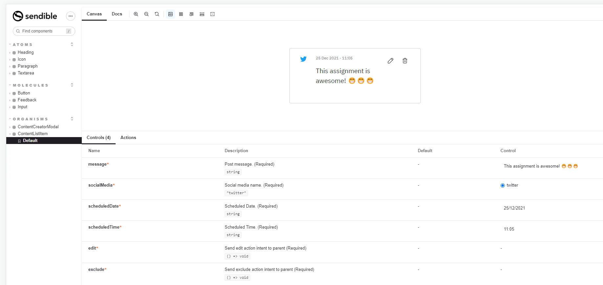
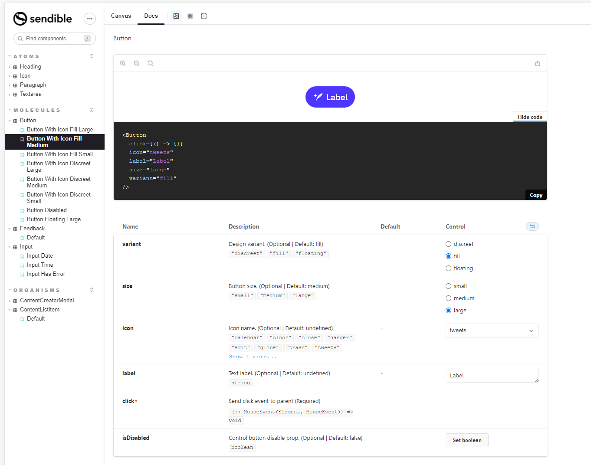
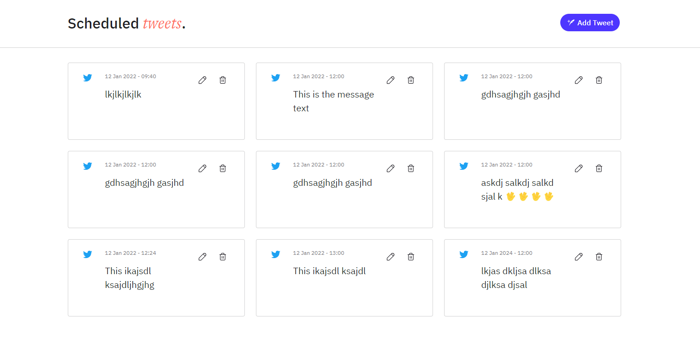
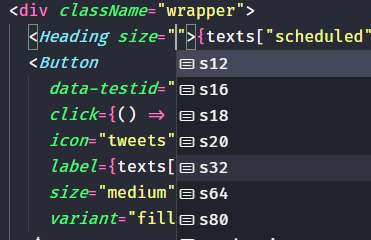
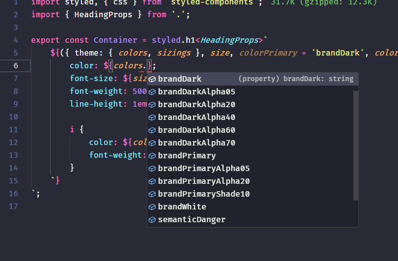
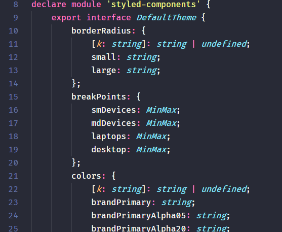

# Sendible by Rdsign

This is an assessment project for Sendible. Here you will find two different projects, one design system + component library and one simple front end project copied from Sendible repository.

The design system + component library stacks:
- React
- Typescript
- Styled Components
- Storybook
- Prettier
- Eslint
- Jest + Testing-library/react

Build with typescript.

<br>
<br>

## Getting started

<br>

#### In the "design_system" folder run the commands:

<br>

1) Install dependencies:
```
yarn
```
2) Create a local package with yarn locallink (it creates a local package which you can use in the front application):
```
yarn locallink
```
3) Run storybook to navigate thru the design system and inspect all the components there
```
yarn start
```
4) You can also run test and see the coverage with:
```
yarn test
```

<br>

#### Now you are ready to start the "front" application. Go to "front" folder and run the commands:

<br>

1) Install dependencies:
```
yarn
```
2) Install the local package generated in the previous steps with yarn:
```
yarn link "@rdsign/sendible-design-system"
```
3) Run the application and see the components live in another application
```
yarn start
```

## Features/Important

Due to the limited time i had, the main focus went to the Design System, so i tried to leave the front application as close as the original, replacing the components with the library ones and small changes on CRA to add webpack aliases. Tests in the front application are gonna fail, because it needs new configs to work with the new components, in other hand, all components are tested in the Component Library (some of them could have more test cases, but again, i ran out of time).

#### Storybook easy to use design system

<br>


<br>

#### Front

<br>

#### Syntax highlight on component props. (Even better if the front project was typescript, because it would alert the developer for missing required props for instance)

<br>

#### Syntax highlight and autofill for styling and typed theme with styled-components.

<br>


<br>


## Dependencies

-   npm 7.6.2+
-   Nodejs 12+
-   Yarn 1.22.10+
